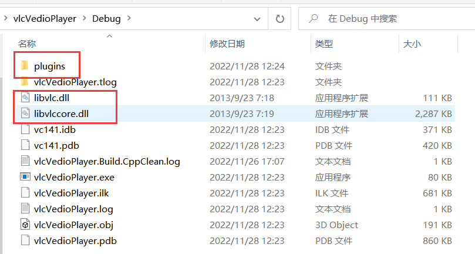

# VLC_SimplePlayer
🚀这是通过VLC实现的一个简单视频播放器，注释完整

[相关博客地址](https://blog.csdn.net/Jacksqh/article/details/128058988)

## 环境
环境：VS2017+VLC+win64
环境配置过程简易步骤：（`详细的配置步骤请看上面博客`）
1.配置include和lib路径
2.生成
3.将sln同级目录下的dll文件夹中的dll文件和sln同级目录下的plugins文件夹复制.exe同级目录

